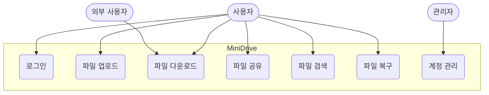
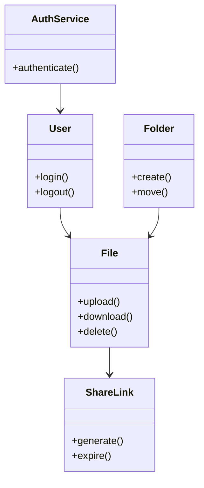
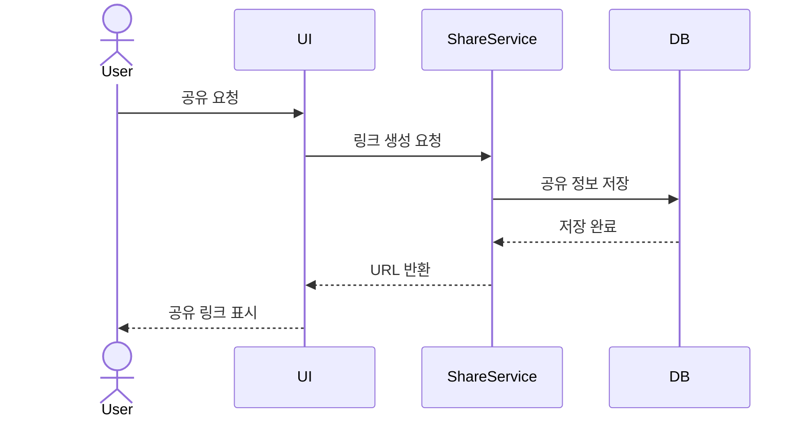
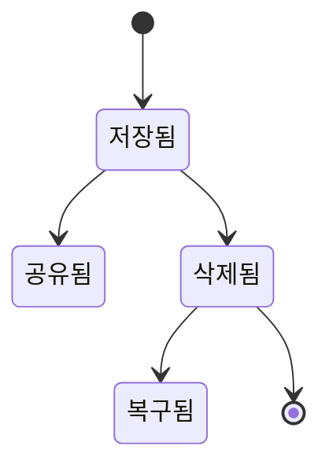

# 📄 [MiniDrive]_RequirementAnalysis_v1.0_260518

# 1. 개요

## 1.1 문서 목적
본 문서는 Mini Drive 시스템의 요구사항을 기반으로 주요 기능과 시스템 구조를 객체지향 관점에서 분석한 문서이다.  
사용자와 시스템 간의 상호작용 및 핵심 객체의 관계를 정의하여 이후 설계 단계의 기초 자료로 활용한다.

---

## 1.2 시스템 개요
Mini Drive는 조직 내 파일을 웹 환경에서 저장·공유·관리할 수 있는 클라우드 기반 파일 관리 시스템이다.  
사용자는 파일 업로드, 다운로드, 공유 링크 생성, 검색 및 복구 기능 등을 수행할 수 있다.

---

# 2. 기능 모델링

## 2.1 액터 식별

| 액터 | 설명 |
|------|------|
| 사용자(User) | 파일 업로드 및 공유 기능을 사용하는 일반 사용자 |
| 관리자(Admin) | 계정 및 저장 공간을 관리하는 관리자 |
| 외부 사용자(Guest) | 공유 링크를 통해 파일에 접근하는 사용자 |

---

## 2.2 주요 유스케이스

| ID | 유스케이스 |
|----|------------|
| UC-01 | 로그인 |
| UC-02 | 파일 업로드 |
| UC-03 | 파일 다운로드 |
| UC-04 | 파일 공유 |
| UC-05 | 파일 검색 |
| UC-06 | 파일 복구 |

---

## 2.3 유스케이스 다이어그램

---

# 3. 구조 모델링

## 3.1 핵심 객체 분석

| 객체 | 역할 |
|------|------|
| User | 사용자 정보 관리 |
| File | 파일 정보 저장 |
| Folder | 폴더 구조 관리 |
| ShareLink | 외부 공유 링크 관리 |
| AuthService | 로그인 인증 처리 |

---

## 3.2 클래스 다이어그램

---

# 4. 행위 모델링

## 4.1 순차 다이어그램 - 파일 공유

---

## 4.2 상태 다이어그램 - 파일 상태

---

# 5. 분석 결과

- 파일 관리 기능을 중심으로 사용자·공유·인증 객체를 식별하였다.
- 주요 기능 흐름을 유스케이스와 순차 다이어그램으로 표현하였다.
- 객체 간 관계를 통해 시스템 구조를 단순화하여 분석하였다.
- 이후 설계 단계에서 데이터베이스 및 API 설계로 확장 가능하다.

---

# 6. 참고 자료

- Mini Drive 요구사항 정의서
- UML 객체지향 분석 강의자료
