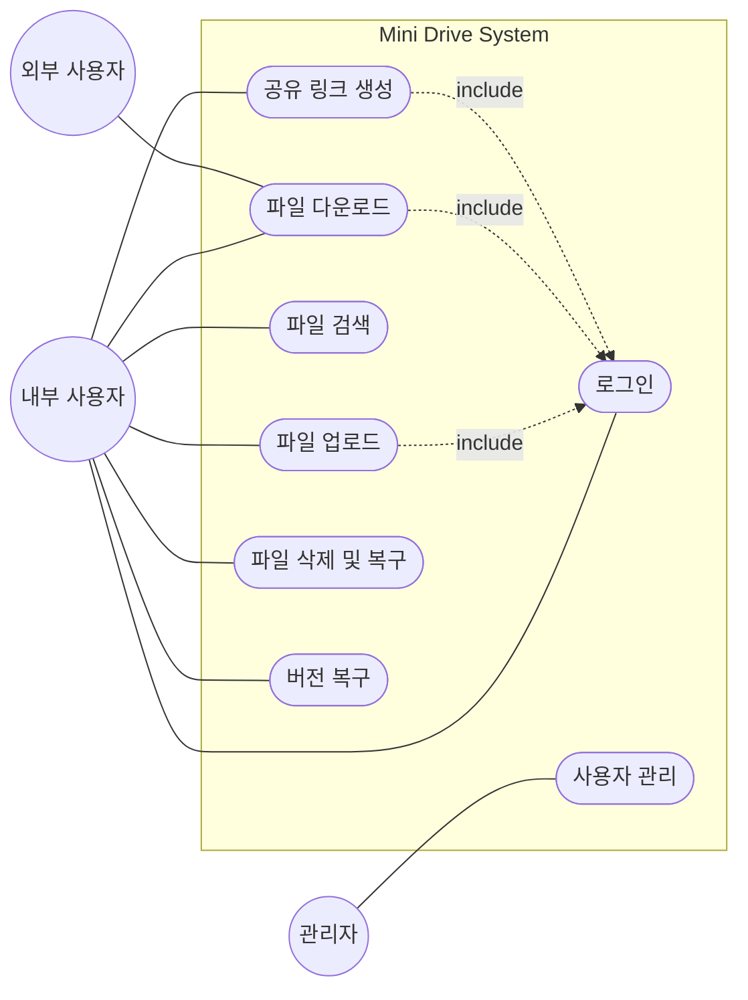
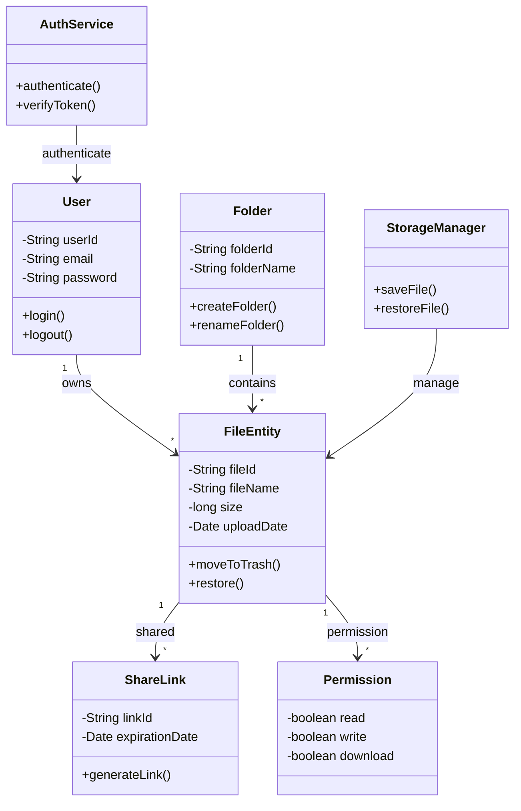
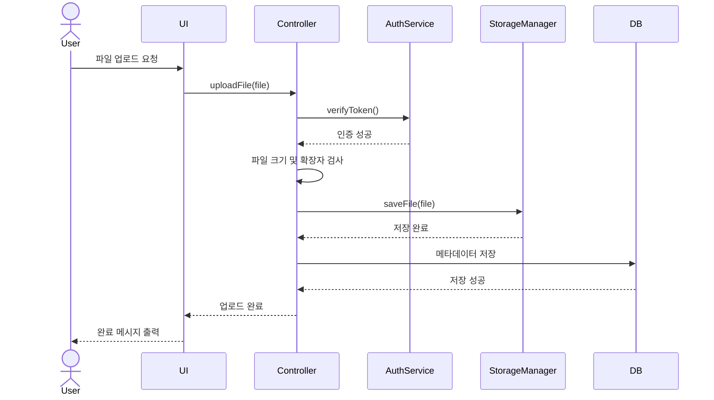
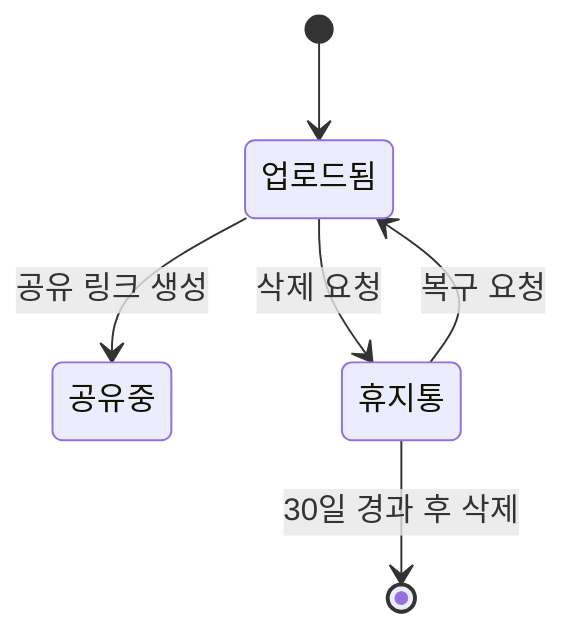

# 📄 [MiniDrive]_RequirementAnalysis_v1.0_260518

# 1. 개요

## 1.1 문서 목적
본 문서는 Mini Drive 시스템의 요구사항 정의서를 기반으로 객체지향 분석(Object-Oriented Analysis)을 수행한 결과를 기술한다.  
사용자와 시스템 간의 상호작용을 분석하기 위한 기능 모델과 시스템 내부 구조를 정의하기 위한 구조 모델, 그리고 시스템 동작 흐름을 표현하기 위한 행위 모델을 포함한다.

---

## 1.2 시스템 개요
Mini Drive는 조직 내 파일을 중앙 서버에서 관리하고 사용자 간 파일 공유 및 협업을 지원하는 클라우드 기반 파일 관리 시스템이다.  
사용자는 웹 브라우저를 통해 파일 업로드, 다운로드, 검색, 공유 및 버전 복구 기능을 수행할 수 있다.

---

## 1.3 용어 정의

| 용어 | 의미 |
|------|------|
| RBAC | 역할 기반 접근 제어(Role-Based Access Control) |
| 공유 링크 | 외부 사용자 접근을 위한 URL |
| 버전 관리 | 파일 변경 내역을 저장하고 이전 상태로 복구하는 기능 |
| 메타데이터 | 파일명, 크기, 업로드 날짜 등의 부가 정보 |

---

# 2. 기능 모델링 (Functional Modeling)

## 2.1 액터(Actor) 식별

| 액터 | 설명 |
|------|------|
| 내부 사용자(User) | 시스템에 로그인하여 파일 업로드, 다운로드, 공유 기능을 사용하는 사용자 |
| 외부 사용자(External User) | 공유 링크를 통해 파일에 접근하는 사용자 |
| 관리자(Admin) | 사용자 계정 및 저장 공간을 관리하는 사용자 |

---

## 2.2 유스케이스(Use Case) 식별

| 유스케이스 ID | 유스케이스명 | 관련 요구사항 |
|--------------|-------------|--------------|
| UC-01 | 사용자 로그인 | FR-01 |
| UC-02 | 파일 업로드 | FR-05 |
| UC-03 | 파일 다운로드 | FR-06 |
| UC-04 | 파일 공유 링크 생성 | FR-12, FR-13 |
| UC-05 | 파일 검색 | FR-15 |
| UC-06 | 파일 삭제 및 복구 | FR-10, FR-11 |
| UC-07 | 파일 버전 복구 | FR-19 |

---

## 2.3 유스케이스 다이어그램

---

# 3. 유스케이스 명세서

## 3.1 UC-02 파일 업로드

| 항목 | 상세 내용 |
|------|-----------|
| 유스케이스 ID | UC-02 |
| 유스케이스명 | 파일 업로드 |
| 주요 액터 | 내부 사용자 |
| 사전 조건 | 사용자가 로그인 상태여야 함 |
| 사후 조건 | 파일 및 메타데이터가 저장됨 |

### 정상 흐름

1. 사용자가 업로드 버튼을 클릭한다.
2. 시스템이 파일 선택 창을 제공한다.
3. 사용자가 파일을 선택한다.
4. 시스템이 파일 크기 및 확장자를 검사한다.
5. 시스템이 파일을 저장한다.
6. 시스템이 업로드 완료 메시지를 출력한다.

### 예외 흐름

- 파일 크기가 제한 용량(2GB)을 초과한 경우:
  - 시스템은 업로드 실패 메시지를 출력한다.

- 허용되지 않은 확장자인 경우:
  - 시스템은 업로드를 차단한다.

---

## 3.2 UC-04 공유 링크 생성

| 항목 | 상세 내용 |
|------|-----------|
| 유스케이스 ID | UC-04 |
| 유스케이스명 | 공유 링크 생성 |
| 주요 액터 | 내부 사용자 |
| 사전 조건 | 사용자가 파일 접근 권한을 가지고 있어야 함 |
| 사후 조건 | 외부 공유용 URL이 생성됨 |

### 정상 흐름

1. 사용자가 파일 선택 후 공유 버튼을 클릭한다.
2. 시스템이 권한 및 만료 기간 설정 창을 제공한다.
3. 사용자가 공유 설정을 입력한다.
4. 시스템이 공유 링크를 생성한다.
5. 시스템이 생성된 URL을 출력한다.

### 예외 흐름

- 만료 기간이 최대 허용 기간을 초과한 경우:
  - 시스템은 재입력을 요청한다.

---

# 4. 구조 모델링 (Structural Modeling)

## 4.1 핵심 클래스 식별

| 클래스명 | 설명 |
|----------|------|
| User | 시스템 사용자 정보 관리 |
| FileEntity | 파일 메타데이터 관리 |
| Folder | 폴더 구조 관리 |
| ShareLink | 외부 공유 링크 관리 |
| Permission | 파일 접근 권한 관리 |
| AuthService | 사용자 인증 처리 |
| StorageManager | 파일 저장 및 복구 처리 |

---

## 4.2 클래스 다이어그램

---

## 4.3 클래스 관계 설명

- User는 여러 개의 FileEntity를 소유할 수 있다. (1:N)
- Folder는 여러 개의 FileEntity를 포함할 수 있다.
- FileEntity는 여러 개의 ShareLink를 생성할 수 있다.
- Permission 객체를 통해 파일 접근 권한을 제어한다.
- AuthService는 사용자 인증 및 토큰 검증을 수행한다.
- StorageManager는 파일 저장 및 복구 기능을 수행한다.

---

# 5. 행위 모델링 (Behavioral Modeling)

## 5.1 순차 다이어그램 - 파일 업로드

---

## 5.2 상태 다이어그램 - 파일 상태

---

# 6. 모델 간 일관성 검증

| 검증 항목 | 내용 |
|-----------|------|
| 기능 모델 ↔ 구조 모델 | 유스케이스에서 사용되는 User, FileEntity, ShareLink 클래스가 클래스 다이어그램에 반영됨 |
| 기능 모델 ↔ 행위 모델 | 파일 업로드 유스케이스가 순차 다이어그램으로 표현됨 |
| 구조 모델 ↔ 행위 모델 | 순차 다이어그램 메시지가 클래스 메서드와 연결됨 |

---

# 7. 참고 자료

- Mini Drive 요구사항 정의서 v1.1
- 객체지향 분석 및 설계 강의자료
- UML Modeling Guide
