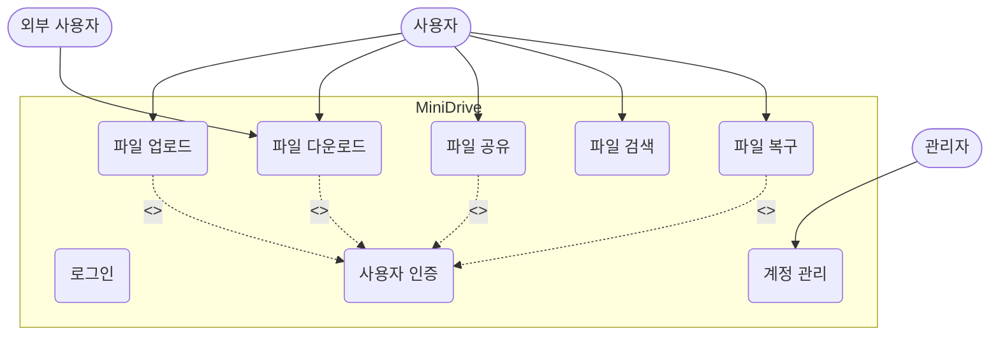
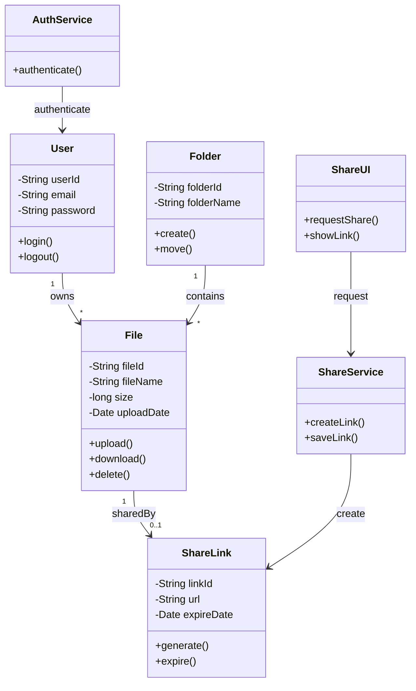
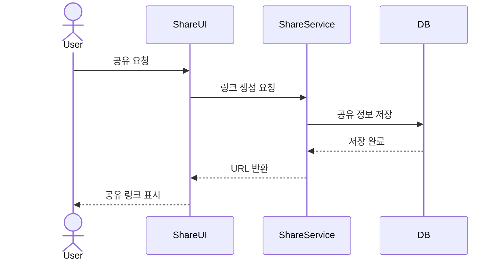
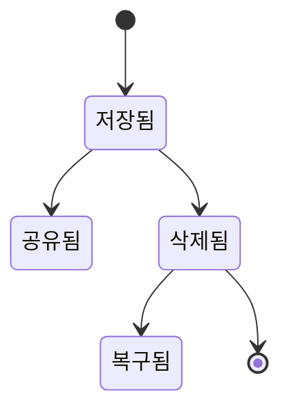

# 📄 [MiniDrive]_RequirementAnalysis_v1.1_260520

# 1. 개요

## 1.1 문서 목적
본 문서는 Mini Drive 시스템의 요구사항을 기반으로 주요 기능과 시스템 구조를 객체지향 관점에서 분석한 문서이다.  
사용자와 시스템 간의 상호작용 및 핵심 객체의 관계를 정의하여 이후 설계 단계의 기초 자료로 활용한다.

---

## 1.2 시스템 개요
Mini Drive는 조직 내 파일을 웹 환경에서 저장·공유·관리할 수 있는 클라우드 기반 파일 관리 시스템이다.  
사용자는 파일 업로드, 다운로드, 공유 링크 생성, 검색 및 복구 기능 등을 수행할 수 있다.

---

# 2. 기능 모델링

## 2.1 액터 식별

| 액터 | 설명 |
|------|------|
| 사용자(User) | 파일 업로드 및 공유 기능을 사용하는 일반 사용자 |
| 관리자(Admin) | 계정 및 저장 공간을 관리하는 관리자 |
| 외부 사용자(Guest) | 공유 링크를 통해 파일에 접근하는 사용자 |

---

## 2.2 주요 유스케이스

| ID | 유스케이스 |
|----|------------|
| UC-01 | 로그인 |
| UC-02 | 파일 업로드 |
| UC-03 | 파일 다운로드 |
| UC-04 | 파일 공유 |
| UC-05 | 파일 검색 |
| UC-06 | 파일 복구 |

---

## 2.3 유스케이스 다이어그램

### 2.4 유스케이스 명세서

#### UC-04 파일 공유

| 항목 | 내용 |
|------|------|
| 유스케이스 ID | UC-04 |
| 유스케이스명 | 파일 공유 |
| 주요 액터 | 사용자(User) |
| 사전 조건 | 사용자가 로그인 상태이며 공유 권한을 가지고 있어야 함 |
| 사후 조건 | 공유 링크가 생성되고 DB에 저장됨 |

##### 정상 흐름 (Main Flow)
1. 사용자가 공유할 파일을 선택한다.
2. 시스템은 로그인 세션 및 권한을 확인한다.
3. 사용자가 공유 요청을 수행한다.
4. 시스템은 공유 링크를 생성한다.
5. 생성된 링크 정보를 데이터베이스에 저장한다.
6. 시스템은 사용자에게 공유 URL을 반환한다.

##### 예외 흐름 (Exception Flow)
- 권한이 없는 경우: 공유 요청을 거부하고 오류 메시지를 출력한다.
- 파일이 존재하지 않는 경우: 링크 생성 요청을 취소한다.

---

# 3. 구조 모델링

## 3.1 핵심 객체 분석

| 객체 | 역할 |
|------|------|
| User | 사용자 정보 관리 |
| File | 파일 정보 저장 |
| Folder | 폴더 구조 관리 |
| ShareLink | 외부 공유 링크 관리 |
| AuthService | 로그인 인증 처리 |
| ShareService | 공유 링크 생성 처리 |
| ShareUI | 사용자 공유 화면 처리 |

---

## 3.2 클래스 다이어그램

---

# 4. 행위 모델링

## 4.1 순차 다이어그램 - 파일 공유

---

## 4.2 상태 다이어그램 - 파일 상태

---

# 5. 분석 결과

- 파일 관리 기능을 중심으로 사용자·공유·인증 객체를 식별하였다.
- 주요 기능 흐름을 유스케이스 및 순차 다이어그램으로 표현하였다.
- 클래스 다이어그램에 객체의 속성과 다중성을 추가하여 구조적 관계를 구체화하였다.
- 순차 다이어그램의 ShareUI, ShareService 객체를 클래스 다이어그램에 반영하여 모델 간 일관성을 유지하였다.
- 이후 설계 단계에서 데이터베이스 및 API 설계로 확장 가능하다.

---

# 6. 참고 자료

- Mini Drive 요구사항 정의서
- UML 객체지향 분석 강의자료
- 객체지향 분석 및 설계 실습 자료
